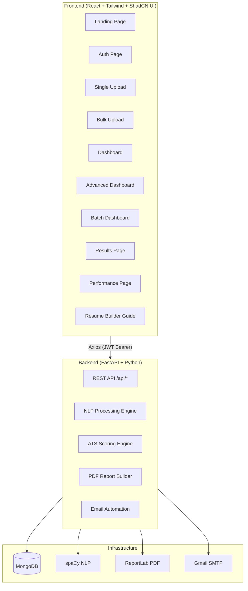

# TalentLens AI — Project Analysis

> **TalentLens AI** is a full-stack AI-powered resume screening and ATS (Applicant Tracking System) scoring platform built by **Prasen Nimje**. It helps recruiters screen, rank, and provide feedback on resumes at scale.

---

## 🏗️ Architecture Overview



---

## 📁 Directory Structure

```
resumee-main/
├── backend/
│   ├── server.py           # Monolithic FastAPI server (~3,546 lines)
│   ├── .env                # MongoDB URL, Gmail SMTP credentials
│   ├── requirements.txt    # 146 Python dependencies
│   └── assets/
│       └── banner.png
├── frontend/
│   ├── src/
│   │   ├── App.js          # Router setup (all routes)
│   │   ├── pages/          # 10 page components
│   │   ├── components/     # 3 shared components + ShadCN UI
│   │   ├── hooks/          # 2 custom hooks
│   │   ├── utils/          # axiosInstance.js + authUtils.js
│   │   └── lib/            # ShadCN utility
│   ├── package.json        # React 19, Recharts, Radix UI
│   └── tailwind.config.js
├── tests/                  # Empty (just __init__.py)
├── design_guidelines.json  # Design system spec (Swiss Organic style)
└── test_result.md
```

---

## 🧠 Backend — `server.py` Deep Dive

The entire backend is a **single 3,546-line FastAPI file** — a monolith. Here's what's inside:

### Pydantic Models
| Model | Purpose |
|-------|---------|
| `ResumeAnalysis` | Core resume analysis data |
| `JobDescription` | JD storage model |
| `AnalyzeRequest` | Single resume analysis request |
| `BulkAnalyzeRequest` | Bulk upload request |
| `DashboardStats` | Stats summary |
| `ShortlistEmailRequest` | Email shortlisting request |
| `UserRegister` / `UserLogin` | Auth models |

### NLP Engine (Custom — No LLM)
- **300+ skill keywords** categorized: `lang`, `web`, `db`, `cloud`, `ai`, `mobile`, `tools`, `biz`, `sec`, `test`
- **Category weights**: `lang:1.5`, `web:1.4`, `ai:1.4`, `db:1.3`, `cloud:1.3`
- **Synonym resolution**: `JS→JavaScript`, `k8s→Kubernetes`, `ReactJS→React`, etc.
- **spaCy NER** (`en_core_web_sm`) for ORG/PRODUCT entity extraction
- **Semantic matching** via `sentence-transformers` (all-MiniLM-L6-v2) — graceful fallback if not installed

### ATS Scoring Algorithm
```
ATS Score = weighted composite of:
  Skills Score    (45%) — skill match + partial credit + semantic bonus
  Experience Score (25%) — multi-strategy extraction (5 strategies)
  Education Score (10%) — tier-based (0=HS, 1=Diploma, 2=Bach, 3=Masters, 4=PhD)
  Title/Seniority (10%) — seniority tier matching
  Keyword Score   (10%) — JD keyword coverage in resume

If skill_score < 20% → composite capped at 35
```

### Experience Detection (5-Strategy Cascade)
1. **Explicit** — "5+ years of experience" → HIGH confidence
2. **Date ranges** — "Jan 2020 – Present" → HIGH confidence
3. **Year span** — earliest to latest year → MEDIUM confidence
4. **Graduation year** → heuristic → LOW confidence
5. **Seniority title** — "Senior Engineer" → LOW confidence

### JD Intelligence
- Classifies JD requirements as `must_have` vs `good_to_have`
- Signal words: `required/mandatory/must` vs `preferred/nice-to-have/optional`
- Scoring: 70% weight on must-have, 30% weight on good-to-have

### Key API Endpoints
| Method | Route | Description |
|--------|-------|-------------|
| POST | `/api/auth/register` | User registration |
| POST | `/api/auth/login` | JWT login |
| POST | `/api/analyze` | Single resume analysis |
| POST | `/api/bulk-analyze` | Bulk resume upload + analysis |
| GET | `/api/dashboard` | Full dashboard data |
| GET | `/api/dashboard/advanced` | Advanced analytics |
| GET | `/api/results/{id}` | Detailed resume results |
| DELETE | `/api/resume/{id}` | Delete resume |
| GET | `/api/resume/{id}/report` | Generate & download PDF report |
| POST | `/api/shortlist-email` | Send shortlist emails |
| GET | `/api/performance` | Performance overview |
| GET | `/api/batch/{id}` | Batch upload dashboard |

### Additional Intelligence
- **Resume Strength Analysis** — 7 category scores: Technical Depth, Skill Diversity, Experience, Education, ATS Keywords, Role Match, Soft Skills
- **Weakness Detection** — Red flags, weaknesses, improvement areas
- **ATS Suggestions** — Prioritized suggestions (High/Medium/Low)
- **Candidate Fit Score** — Composite of ATS + Strength + Weakness
- **Top 3 Role Detection** — Matches resume against 16 role profiles
- **PDF Report Builder** — Full branded PDF via ReportLab
- **Email Automation** — 5 email templates: shortlist, thanks, interview, next_round, rejection

---

## 🎨 Frontend — React Architecture

### Tech Stack
- **React 19** with Create React App (via CRACO)
- **React Router v7** — client-side routing
- **TailwindCSS v3** — styling
- **ShadCN UI** — component library (all Radix UI primitives)
- **Recharts** — data visualization
- **Axios** — API client with JWT interceptors
- **Sonner** — toast notifications

### Design System ("Swiss Organic")
| Token | Value |
|-------|-------|
| Primary | `#1A4D2E` (Deep Forest Green) |
| Secondary | `#F0FDF4` (Pale Mint) |
| Accent | `#D9F99D` (Electric Lime) |
| Background | `#FFFFFF` / `#F8F9FA` |
| Fonts | Outfit (headings) + Manrope (body) |

### Pages
| Page | Route | Description |
|------|-------|-------------|
| `LandingPage` | `/` | Marketing page with live demo animations |
| `AuthPage` | `/auth` | Login/Register |
| `SingleUploadPage` | `/single` | Upload + analyze one resume |
| `BulkUploadPage` | `/bulk` | Upload + analyze multiple resumes |
| `DashboardPage` | `/dashboard` | Manual scan analytics dashboard |
| `AdvancedDashboardPage` | `/dashboard/advanced` | AI-powered insights dashboard |
| `BatchDashboardPage` | `/batch/:batchId` | Batch upload results |
| `ResultsPage` | `/results/:resumeId` | Detailed resume analysis view |
| `PerformanceResultsPage` | `/performance` | Performance overview hub |
| `ResumeBuilderGuidePage` | `/resume-guide` | ATS resume writing tips |

### Auth Flow
- JWT stored in `localStorage` as `userAuth` JSON
- Auto-injected via Axios request interceptor
- 401 responses → auto-logout + redirect to `/auth`
- Session tracking via `sessionId` in localStorage

### Dashboard Features
- **KPI Cards**: Total resumes, avg score, top candidates, need improvement
- **Charts**: Pie (score distribution), Histogram, Bar (top 10), Area (trend), Funnel
- **Filters**: Search, Job Title, Score Range, Sort (6 options)
- **Bulk Select**: Select all, select top candidates, bulk delete
- **Date/Time Range Filter**: Filter by upload timestamp

---

## 🔧 Infrastructure & Config

### MongoDB
- URL: `mongodb://localhost:27017/resume_main`
- DB: `Resume_Main`
- Uses `motor` (async MongoDB driver)

### Email (Gmail SMTP)
- Sender: `talentlens.solutions@gmail.com`
- Uses built-in `smtplib` (no extra packages)
- Supports PDF report attachments

### Authentication
- `bcrypt` password hashing
- `PyJWT` token generation
- No refresh tokens (simple JWT in localStorage)

---

## 🔍 Key Observations

### Strengths ✅
1. **Rich NLP pipeline** — no external LLM dependency, fast and deterministic
2. **Sophisticated ATS scoring** — multi-dimensional with proper weight redistribution
3. **JD Intelligence** — differentiates must-have vs nice-to-have skills
4. **Beautiful UI** — premium design system consistently applied
5. **Comprehensive analytics** — 8+ chart types in dashboards
6. **Email automation** — 5 built-in templates with PDF attachments
7. **Role detection** — matches resume to 16 role profiles
8. **Semantic matching** — optional sentence-transformers enhancement

### Potential Improvements 🔧
1. **Monolithic backend** — `server.py` is 3,546 lines, should be split into routers
2. **No tests** — `tests/` directory is completely empty
3. **No refresh tokens** — JWT auth is basic; no token expiry handling
4. **CORS is `*`** — should be restricted in production
5. **Credentials in `.env` committed** — Gmail password is visible
6. **No rate limiting** — API has no throttling
7. **Frontend env** — `REACT_APP_BACKEND_URL` defaults to localhost (fine for dev)
8. **No error boundaries** — React doesn't have global error handling
9. **Database not indexed** — No index setup for MongoDB queries

### Feature Completeness
- ✅ Single resume analysis
- ✅ Bulk resume upload + batch processing
- ✅ User authentication
- ✅ Detailed analytics dashboards
- ✅ PDF report generation
- ✅ Email shortlisting with templates
- ✅ Resume builder guide
- ✅ Batch history tracking
- ✅ Advanced AI insights dashboard
- ✅ Mobile-responsive design

---

## 🚀 How to Run

**Backend:**
```bash
cd backend
pip install -r requirements.txt
python server.py
# Runs on http://localhost:8000
```

**Frontend:**
```bash
cd frontend
yarn install
yarn start
# Runs on http://localhost:3000
```

> Requires MongoDB running locally on port 27017.
